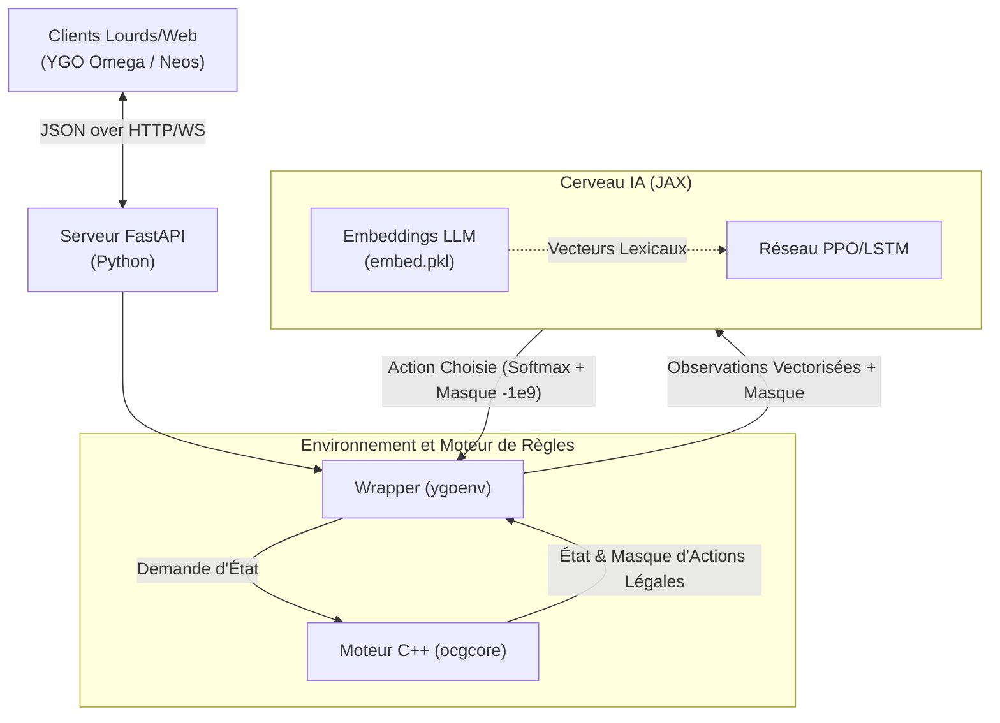
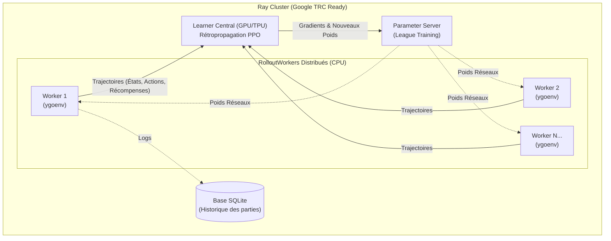
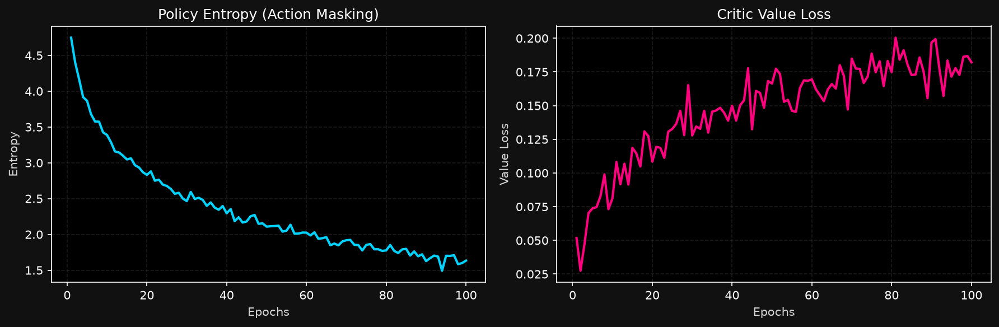

# YGO Bot: Autonomous Intelligent Agent for Yu-Gi-Oh! Omega using Deep RL and LLMs


## 1. Résumé Scientifique

Yu-Gi-Oh! n'est pas qu'un simple jeu de cartes, c'est un problème mathématique extrêmement complexe, formellement classé comme **Π₁¹-complet**. L'environnement de jeu est un **Processus de Décision Markovien Partiellement Observable (POMDP)** caractérisé par :
- Un **espace d'états gigantesque** (> 10 000 cartes uniques).
- Une **forte asymétrie d'information** (cartes face cachée, brouillard de guerre sur la main adverse).
- Des **chaînes de résolution d'effets profondément imbriquées** à chaque étape.

**L'Objectif de ce projet** est d'atteindre des performances surhumaines et une capacité de **Zero-shot generalization** en séparant strictement l'exécution du moteur de règles déterministe (C++) de la prise de décision stratégique (JAX/Ray).

---

## 2. Architecture Technique

Pour résoudre un tel problème, ce projet déploie une stack technologique de pointe conçue pour maximiser l'efficacité de l'infrastructure matérielle (GPU/TPU) :

- **Le Cerveau (Deep RL sous JAX)** : Utilisation de **JAX** pour la compilation Just-In-Time (XLA) et la vectorisation massive sur accélérateurs matériels. Le modèle repose sur l'algorithme **PPO (Proximal Policy Optimization)** combiné à des couches **LSTM** pour modéliser la mémoire temporelle de l'agent et gérer l'état de croyance (*Belief State*) face aux informations cachées.
- **La Planification (Gumbel AlphaZero & IS-MCTS)** : Implémentation avancée de la recherche arborescente de Monte-Carlo pour l'anticipation temporelle des coups et la modélisation sous brouillard de guerre.
- **L'Orchestration Distribuée (Ray)** : Ce projet est nativement configuré avec le **Ray Cluster Launcher** pour être déployé à très grande échelle sur des clusters Cloud, notamment le **Google TPU Research Cloud (TRC)**.
### Le Produit : Diagramme de l'Inférence

Ce flux montre l'interaction temps réel lors d'une partie. Le réseau JAX ne calcule jamais sur un état invalide, grâce au pont C++ de masquage.



### La Recherche : Diagramme de l'Entraînement Distribué

Pour s'entraîner sur des millions de parties, le système déploie un apprentissage par renforcement massivement distribué.



---

## 3. L'Innovation : Le "Zero-Shot" via les Embeddings LLM

Face au mur combinatoire que représentent des dizaines de milliers de "nouvelles cartes", une approche basée sur des identifiants statiques (passcodes) est vouée à l'échec.
Au lieu de cela, **YGO Bot convertit les descriptions textuelles officielles des cartes (PSCT) via un Grand Modèle de Langage (LLM)** pour générer des représentations vectorielles continues de 384 dimensions (`embed.pkl`). 
Cette projection sémantique permet à l'IA de comprendre et de transférer sa connaissance des mécaniques de jeu vers des **cartes qu'elle n'a jamais rencontrées à l'entraînement**.

---

## 4. Le Pipeline de Données et l'Intégration

Ce projet n'est pas un simple prototype, c'est un écosystème interconnecté :
- **Synchronisation des Données** : Automatisation de la mise à jour des données (nouveaux sets de cartes, métagame) via l'utilisation des API officielles de **YGOPRODeck** (TypeScript/Dart).
- **Interopérabilité des Decks** : Intégration de `omega-api-decks` pour parser dynamiquement les formats hétérogènes de l'écosystème communautaire (`.ydk`, JSON, code Omega).
- **Déploiement API temps réel** : Le modèle JAX est encapsulé dans une **API FastAPI**. Grâce au typage et au chargeur *In-Memory*, l'inférence offre des temps de réponse ultra-faibles (< 100 ms) pour affronter des joueurs humains via les clients lourds comme **YGO Omega** (via `DuelBotWrapper` C#) ou le client web **Neos**.

---

## 5. L'État d'Avancement Actuel (MVP)

La preuve de concept fondatrice est validée :
- **MVP Fonctionnel** : Le pipeline d'entraînement asynchrone **PPO Pur ("Cold Start")** est opérationnel en local via Ray.
- **Stabilité prouvée** : Le pont entre Python et C++ au sein de l'environnement Gym (`ygoenv`) est stabilisé (gestion des épisodes de longueurs variables, remise à zéro sécurisée des états). L'environnement fonctionne de manière asynchrone et sans fuite de mémoire sur des threads CPU dédiés, laissant toute la puissance du GPU à la rétropropagation JAX.
- **Jalon Actuel** : L'intégration 100% vectorisée de l'**Action Masking** sous JAX a drastiquement réduit l'entropie de l'agent, propulsant sa découverte de combos valides.


*Preuve de concept locale : Baisse de l'entropie et apprentissage initial sur mini-deck via RTX 3070 Ti, validant la rétropropagation des gradients sous JAX.*

---

## 6. Pourquoi nous avons besoin de Google TRC ?

Ce projet a franchi la phase 1 : sur une architecture grand public (ex: RTX 3070 Ti), l'agent converge avec succès et découvre des synergies de base sur des decks statiques grâce à PPO.

Cependant, nous faisons désormais face au **Mur du Calcul**.
Pour qu'un modèle RL de cette ampleur (POMDP, espace d'observation de 60,694 dimensions) atteigne un niveau "Championnat" capable de s'adapter dynamiquement au métagame, il doit affronter des dizaines de millions de scénarios via le paradigme du **League Training** (l'agent joue en boucle contre des versions antérieures de lui-même).
Par ailleurs, activer la véritable anticipation arborescente (IS-MCTS / Gumbel AlphaZero) entraîne des coûts computationnels massifs liés au *Action Replay* de l'état C++ du jeu pour simuler les futurs possibles.

**La conclusion est simple :** L'algorithme mathématique converge, le code est massivement parallélisable. Nous sollicitons désormais la puissance colossale des TPUs Google (via Ray) pour propulser l'agent au-delà du potentiel d'un joueur humain.

---

## 7. Installation et Reproduction

Pour les chercheurs et évaluateurs souhaitant reproduire le système :

1. **Clonage du repo** :
   ```bash
   git clone https://github.com/Kevzi/YGO-BOT.git
   cd YGO-BOT
   ```

2. **Configuration Python (Poetry)** (Requis: Python 3.10+ / JAX) :
   ```bash
   poetry install
   ```
   *Assurez-vous que le moteur `ocgcore.dll` est compilé dans le dossier `core/ygoenv/`.*

3. **Lancement des Workers Locaux** :
   Veillez à ce que les processus RolloutWorkers s'exécutent strictement sur le CPU :
   ```bash
   export JAX_PLATFORMS="cpu" 
   python scripts/train_distributed.py
   ```

4. **Serveur d'Inférence** (Pour affronter le bot) :
   ```bash
   uvicorn src.api.main:app --reload --port 3000
   ```

---

## 8. Remerciements et Crédits

Ce projet s'appuie fièrement sur des années de travaux open-source. Un immense merci à :
- **[ygo-agent](https://github.com/sbl1996/ygo-agent)** (par sbl1996) pour l'inspiration fondamentale de l'environnement Gym et de l'architecture JAX originelle.
- L'équipe de **[ygopro-core / ocgcore-KCG](https://github.com/knight00/ocgcore-KCG)** pour la maintenance incroyable du moteur de règles déterministe C++.
- **[Duelists Unite](https://github.com/duelists-unite)** pour la communauté YGO Omega et l'infrastructure de wrappers C# (`DuelBotWrapper`).

---
*Graphs de progression des victoires (Win Rate / Elo) & TensorBoard à venir lors du premier scale sur TPU !*
