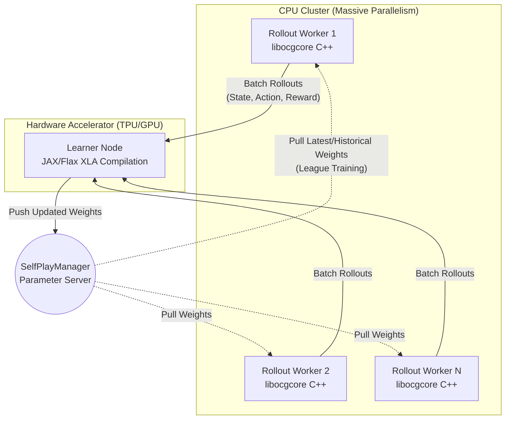
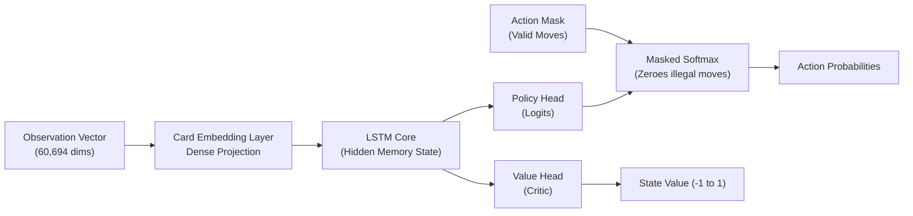
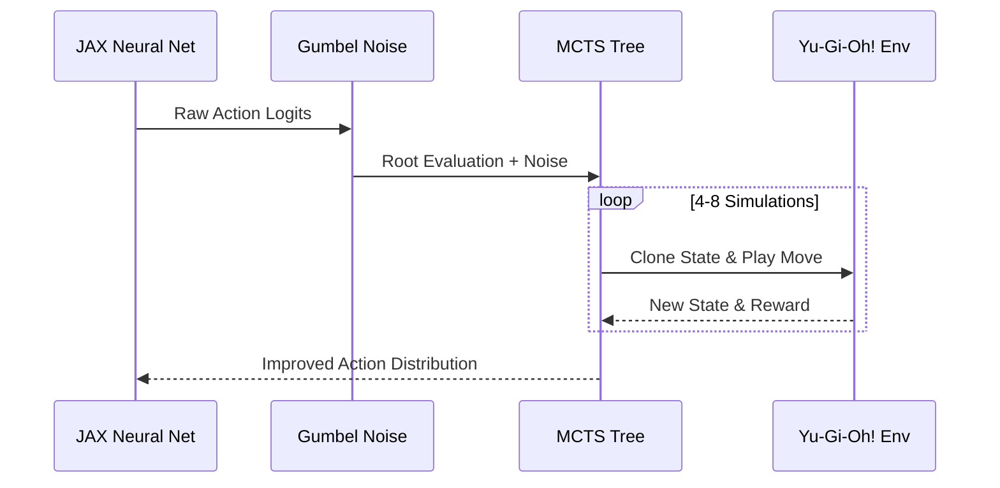

<div align="center">
  <h1>🐉 YGO-BOT</h1>
  <p><b>Massive-Scale Distributed Deep Reinforcement Learning for Yu-Gi-Oh!</b></p>
  <p><i>Powered by JAX, Flax, Ray, and Gumbel AlphaZero</i></p>
</div>

<br/>

YGO-BOT is an open-source research project aimed at creating a super-human AI for the Yu-Gi-Oh! Trading Card Game. By combining **Proximal Policy Optimization (PPO)**, **Gumbel AlphaZero MCTS**, and a fully distributed asynchronous **Ray** architecture, this agent is designed to scale on massive cloud computing infrastructures (like Google TPUs) to tackle one of the most complex board/card games in existence.

---

## 🧠 The Challenge: Why Yu-Gi-Oh! ?

Yu-Gi-Oh! presents unique challenges for Artificial Intelligence, far exceeding the combinatorial complexity of Chess or Go:

| Challenge | Description |
| :--- | :--- |
| **Massive State Space** | Over 10,000 unique cards with complex, chaining effects. Our environment observation vector has **60,694 dimensions**. |
| **Imperfect Information** | Hands and face-down cards are completely hidden from the opponent, requiring probability estimation and memory. |
| **Dynamic Action Space** | Up to 200 contextual actions (Summon, Activate, Chain, Attack) that dynamically change at every micro-step. |

---

## 🏗️ Technical Architecture

### 1. Distributed Asynchronous Self-Play (Ray)
To overcome the massive computational requirement of C++ environment simulations, we implemented a decoupled Actor-Learner architecture using **Ray**.



- **Rollout Workers (CPU)**: Hundreds of lightweight actors run the C++ Yu-Gi-Oh! engine (`libocgcore`) to simulate games in parallel. They are restricted from GPU access to avoid VRAM bottlenecks.
- **Learner (GPU/TPU)**: A centralized actor that receives batches of rollouts and performs rapid Backpropagation using JAX's `jit` compilation.
- **Parameter Server**: Maintains a history of network weights to train the agent against previous versions of itself (League Training), ensuring robust monotonic improvement.

### 2. Neural Network (JAX/Flax)
The core of the agent is a highly optimized `ActorCriticLSTM` network written purely in **Flax/JAX**.


- **Action Masking**: A critical mechanism that zeroes out illegal actions dynamically at the logits level, preventing the network from wasting gradient updates on invalid moves.

### 3. Gumbel AlphaZero & PPO
We completely bypass manual *Reward Shaping* (which leads to Reward Hacking) and rely purely on the sparse end-game reward (+1 Win, -1 Loss).



- **MCTS with Gumbel Noise**: By injecting **Gumbel noise** at the root (Gumbel AlphaZero variant), the agent achieves stable exploration without needing the hundreds of simulations required by traditional Dirichlet noise.
- **Curriculum Learning**: The architecture supports toggling MCTS off for a "Cold Start" rapid pure-PPO training, then activating MCTS for deep tactical fine-tuning.
- **Generalized Advantage Estimation (GAE)**: Stabilizes policy updates over extremely long episodes.

---

## 🚀 Why We Need Google TRC (TPU Research Cloud)

While the architecture is mathematically sound and highly optimized locally, mastering Yu-Gi-Oh! requires an enormous amount of self-play to converge.
- A single Rollout Worker needs to clone the C++ environment state hundreds of times per game to build the MCTS tree.
- On a high-end local machine (RTX 3000 series + 8-core CPU), generating a single batch of rollouts takes several minutes.
- To reach professional human level, the agent must play **millions of games**.

**Google TPUs** (via JAX's native XLA compilation) combined with a massive CPU cluster for Ray workers is the only way to scale this project from an architectural MVP to a superhuman agent. The code is inherently **TPU-ready** through JAX.

---

## 🛠️ Setup & Local Training

### Requirements
- Python 3.12+
- WSL2 (for Windows users, required for the C++ engine)
- JAX & Flax
- Ray Cluster

### Running the Distributed Training
To launch the cluster locally and begin the PPO Self-Play loop:
```bash
python scripts/train_distributed.py
```
*(Tip: Set `PYTHONUNBUFFERED=1` to see real-time Ray logs)*

---

<p align="center">
  <i>This project is built upon libocgcore and draws inspiration from DeepMind's AlphaZero and deep reinforcement learning breakthroughs.</i>
</p>
