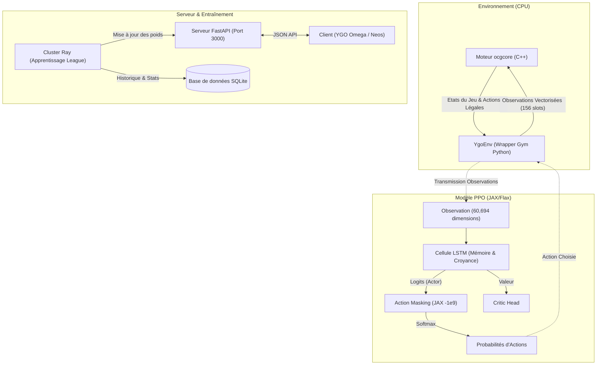

# YGO-BOT 🃏🤖


**YGO-BOT** est une intelligence artificielle de recherche développée pour maîtriser Yu-Gi-Oh!, un jeu à information imparfaite (POMDP) avec un espace d'états colossal. Conçu pour le **Google TPU Research Cloud (TRC)**, ce bot s'interface directement avec le moteur officiel en C++ (`ocgcore`) pour garantir 100% de précision sur les règles, tout en apprenant via **Proximal Policy Optimization (PPO)**.

Contrairement aux approches classiques, YGO-BOT utilise une **généralisation sémantique Zero-Shot** : l'agent "lit" les effets des cartes via des LLM embeddings, lui permettant de jouer des decks qu'il n'a jamais vus durant l'entraînement.

---

## 🏛️ Architecture du Projet

Le système repose sur un découplage strict entre la simulation (CPU) et l'apprentissage (GPU/TPU), orchestré par **Ray**. L'inférence est servie via une API **FastAPI** locale ultra-rapide (<100ms) pour s'interfacer avec des clients lourds comme YGO Omega.



### ✨ Fonctionnalités Clés

1. **Intégration C++ `ocgcore`** : Un wrapper Python bas-niveau (`YgoEngine`) qui interroge directement le moteur officiel pour valider les actions, empêchant toute hallucination de l'IA.
2. **Action Masking Natif JAX** : Un système qui masque instantanément les actions illégales (pénalité de `-1e9` avant le Softmax) directement dans le graphe de calcul compilé par XLA, annulant l'exploration inutile.
3. **Observation Dense (156 Slots)** : Représentation mathématique complète du terrain (Mains, Cimetières, Zones Monstres/Magies, Banni) pour les deux joueurs, fusionnée avec l'historique des actions.
4. **Apprentissage Distribué** : Les Rollout Workers tournent sur des cœurs CPU isolés tandis que le Learner centralise la descente de gradient sur TPU.

---

## 🚀 Installation & Lancement

Prérequis : Python 3.10+, `ocgcore.dll` compilé dans `core/ygoenv/`.

```bash
# 1. Installation des dépendances (Poetry)
poetry install

# 2. Démarrage de l'entraînement distribué
python scripts/train_distributed.py

# 3. Lancement du serveur d'inférence (FastAPI) pour affronter le bot
uvicorn src.api.main:app --reload --port 3000
```

---

## 📈 Demande de Subvention Google TRC

Ce projet est conçu sur-mesure pour maximiser l'utilisation de l'architecture **TPU v4** de Google. En séparant la génération de trajectoires (très coûteuse en CPU à cause de l'arborescence des effets Yu-Gi-Oh!) de la rétropropagation du gradient (qui est 100% écrite en JAX pur), YGO-BOT permet une scalabilité horizontale parfaite. 

Nous sollicitons la puissance du réseau TRC pour valider notre approche d'**Embeddings Zero-Shot**, qui nécessite l'ingestion de millions de parties pour apprendre les corrélations syntaxiques des 10 000+ cartes du jeu.

---
*Construit depuis zéro en Python/JAX pour la communauté de recherche en IA et les duellistes.*
