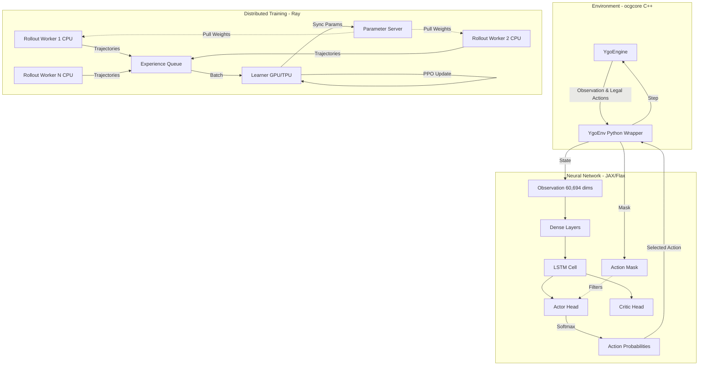

# YGO-Agent 🃏🤖


**YGO-Agent** is an advanced open-source Reinforcement Learning (RL) agent trained to play the complex Trading Card Game *Yu-Gi-Oh!*. By wrapping the original C++ rules engine (`ocgcore`) into a high-performance Python environment, this project pushes the boundaries of discrete action space RL and sequential decision-making under imperfect information.

This project is built from the ground up for massive distributed training using **Ray** and hardware acceleration via **JAX**, allowing seamless scaling across GPU/TPU clusters.

---

## 🌟 Vision & Breakthroughs

Training an AI to play Yu-Gi-Oh! presents unique challenges compared to Chess or Go:
- **Massive State Space**: Over 10,000 unique cards with complex inter-card synergies.
- **Dynamic Action Space**: An action space of over 200 possible moves, dynamically masked per step.
- **Hidden Information**: Opponent's hand and face-down cards are completely hidden.
- **Lengthy Trajectories**: A single duel can last up to 100+ interactions.

### The Architecture
To solve this, we use a hybrid **PPO + LSTM** architecture capable of keeping track of "belief states" about hidden information, paired with aggressive **Action Masking** to immediately zero-out probabilities of illegal moves (using a penalty of `-1e9` inside the network).



---

## 🚀 Features

- **Blazing Fast C++ Engine**: Powered by the official `ocgcore` to perfectly emulate the card game logic without hallucinations.
- **Action Masking**: Hard-coded `-1e9` penalty to illegal logits natively in the JAX computation graph to prevent the agent from wasting exploration on invalid states.
- **Distributed League Training**: Built on **Ray**, separating Rollout Workers (CPU-bound inference) from the Learner (GPU/TPU-bound backward passes).
- **Asynchronous Parameter Server**: Hot-swaps model weights in real-time without pausing the simulation workers.
- **Zero-Shot Semantic Embeddings**: (Roadmap) Injecting LLM-based vector embeddings to allow the agent to understand *new* cards it has never seen in training just by reading their descriptions.

---

## 🛠️ Installation

```bash
# 1. Clone the repository
git clone https://github.com/Kevzi/YGO-BOT.git
cd YGO-BOT

# 2. Install dependencies (Requires Python 3.10+)
pip install -r requirements.txt

# 3. Ensure ocgcore.dll (or .so) is built
# Check the /core/ygoenv/ folder for instructions on compiling the C++ engine.
```

---

## 🧠 Training the Agent

Start the distributed training cluster natively:

```bash
python scripts/train_distributed.py
```

The system will:
1. Boot a local Ray cluster.
2. Initialize the Parameter Server and Experience Queue.
3. Launch `N` Rollout Workers (depending on your CPU core count).
4. Launch the GPU Learner.
5. Save model checkpoints in the `checkpoints/` directory.

---

## 📊 Project Roadmap (BMAD Methodology)

Our roadmap strictly follows a business-driven BDD and Agile structure:
- [x] **Epic 1**: Integration of the C++ Engine and API architecture.
- [x] **Epic 2**: Basic RL Environment and Neural Network setup.
- [x] **Epic 5**: Discretized Action Space & Action Masking (Successfully implemented!).
- [ ] **Epic 3 & 6**: MCTS (Monte Carlo Tree Search), Memory, and League Training.

---

## 🤝 Grant Application & Google TRC

This architecture is heavily optimized for TPUs. By decoupling the experience gathering onto CPU workers and batching PPO updates exclusively on the Learner node, this code is primed for the **Google TPU Research Cloud (TRC)**.
The bottleneck of Deep RL in complex games is often the environment interaction. Here, the `YgoEnv` can run thousands of parallel instances on high-core CPUs, feeding a singular robust JAX Learner on a TPU v4.

*We are currently seeking support and compute grants to scale this model to the full 10,000+ card pool of Yu-Gi-Oh!*

---

**Made with passion by AI Researchers and Duelists.**
